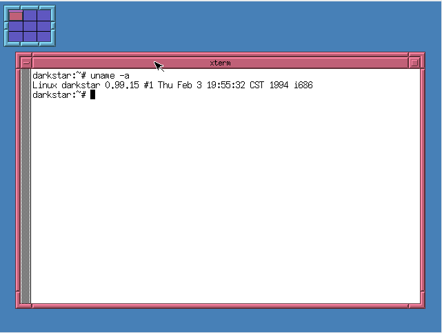

# Slackware 1.1.2 (i386)

A very early release of Slackware Linux from 1994.

Installation is probably best done by downloading all
disksets to a directory and mounting that with QEMU and from
within the installer mounting that to a seperate directory:

```
mount -t msdos /dev/hdb1 /mnt2
```

Contains a rather ancient gcc/g++ (v2.5.8) and kernel 0.99.15

I couldn't get 256 color SVGA working in this release. I believe
XFree86 2.0 is just too old to recognize QEMU's Cirrus Logic card.


